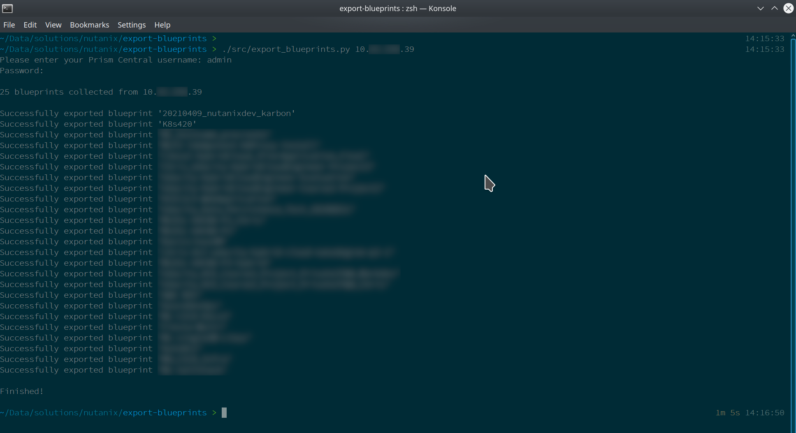

# Save Calm Blueprints

Python 3.8 script to connect to Prism Central 5.19 or above and export all Nutanix Calm blueprints to JSON files.

## Disclaimer

This is *not* a production-grade script.  Please make sure you add appropriate exception handling and error-checking before running it in production.  See note re versions below, too.

## Author

Chris Rasmussen, Developer Content Architect, Nutanix (Melbourne, AU)

## Changelog

- 2021.04.09 - Script updated
- 2018.09.21 - Script created

## Details

Connect to a Nutanix Prism Central instance, grab all Calm blueprints and save them to JSON files.

The intention is to use this script to take a quick backup of your Calm blueprints, without the need to manually export each one individually.

The other idea is for you, the user, to take this script and modify it to suit your requirements.

## Requirements

- Python >=3.8
- pip3 (to install dependencies)

## Script Usage (Linux)
----------------------

- Clone this repository
- Create and activate a virtual environment:

  ```
  python3.8 -m venv venv
  . venv/bin/activate
  ```

- Install dependencies:

  ```
  pip3 install -r requirements.txt
  ```

- Run the script:

  ```
  ./src/export_blueprints.py <prism_central_ip_address> [ --username username ] [ --password password ]
  ```

## Screenshot



## Disclaimer

Please see the `.disclaimer` file distributed with this repository.

## License

Please see the `LICENSE` file distributed with this repository.
